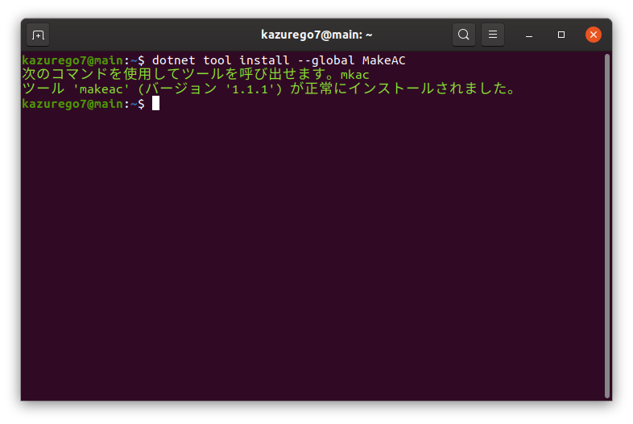
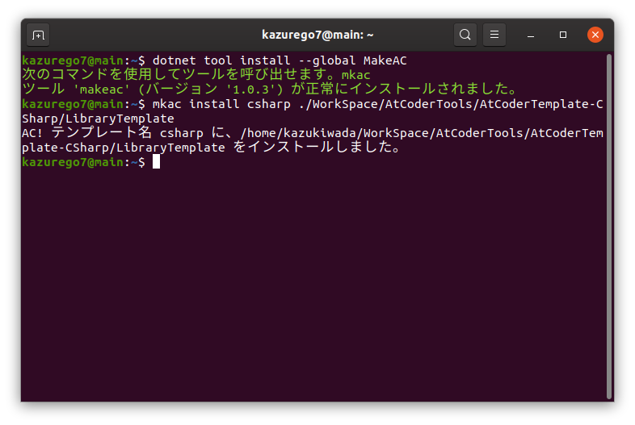
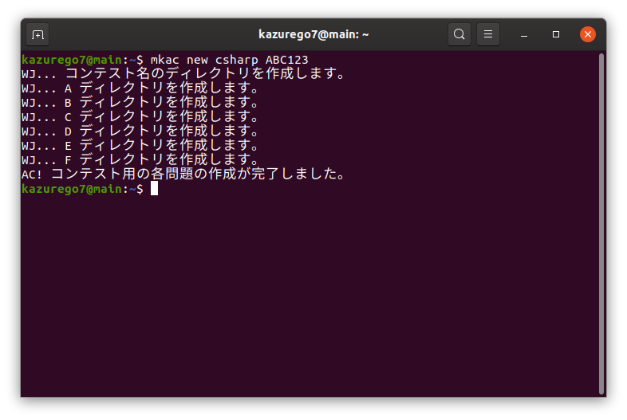
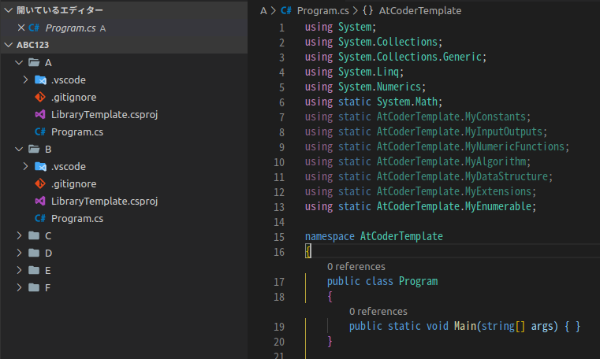
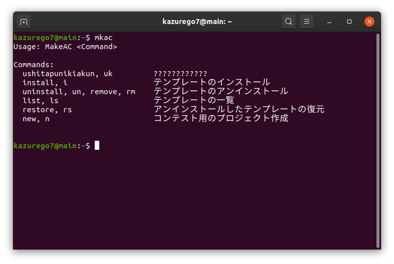
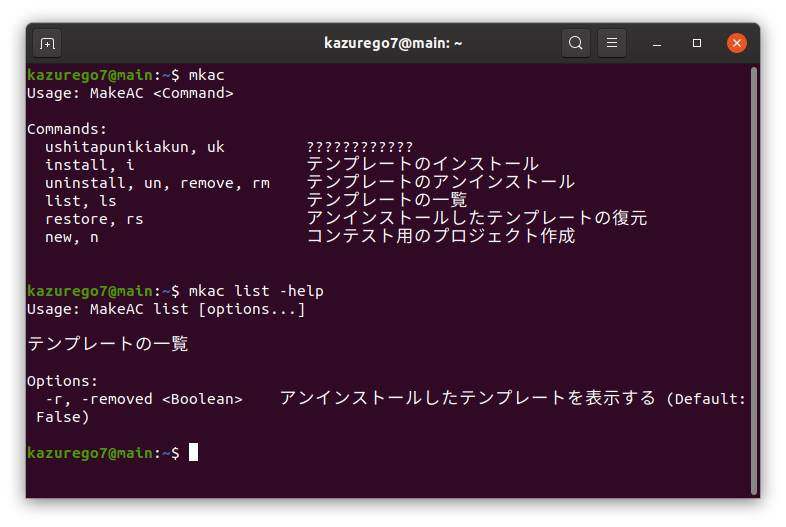

# MakeAC
MakeAC は、競技プログラミング(AtCoder)用のテンプレート生成ツールです。

以下の3ステップで、ツールのインストール、テンプレートの登録、コンテスト用プロジェクトの作成が行えます。

1. MakeAC のインストール
    ```
    dotnet tool install --global MakeAC
    ```

    

2. テンプレートの登録
    ```
    mkac install [テンプレート名] [テンプレートのパス]
    ```

    

3. コンテスト用プロジェクトの作成
    ```
    mkac new [テンプレート名] [コンテスト名]
    ```

    

    

## その他機能

mkac コマンドでサブコマンドを指定しないと、ヘルプが表示されます。



サブコマンドも `-help` オプションをつけることで、ヘルプが表示されます。


